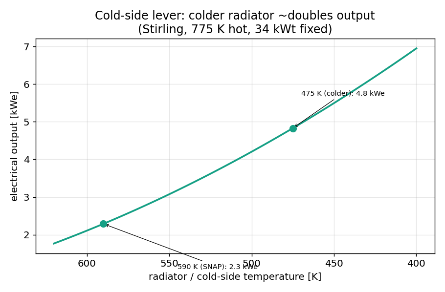
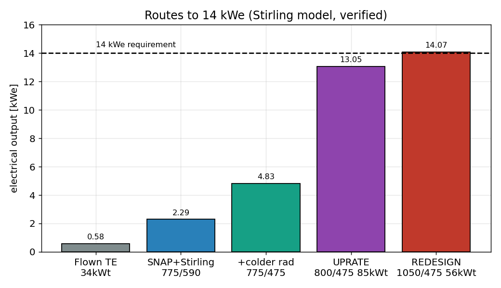
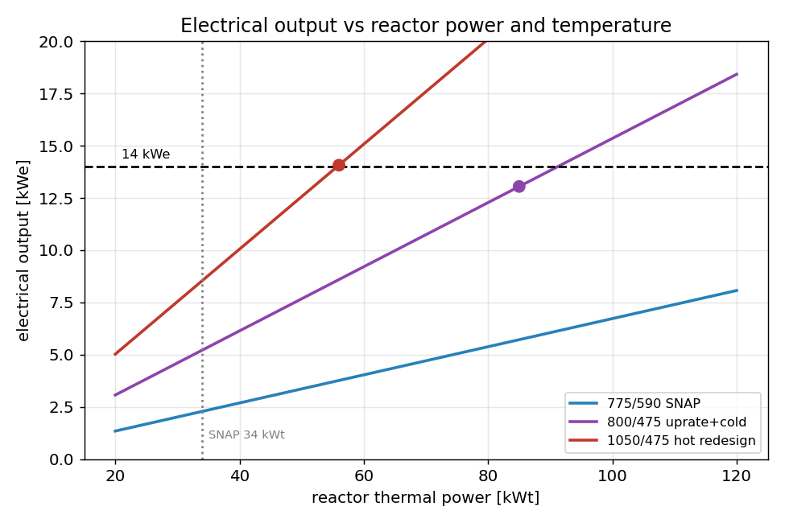

# Path to 14 kWe: briefing with verified numbers

Prepared June 2026. This pulls together the two existing analyses
(`Stirling_Design_and_Path_to_14kWe.md` and `Power_Uprate_Verification_Roadmap.md`)
into one briefing, re-runs the Stirling model to verify every number, and answers the
cold-side question directly. All electrical outputs below come from
`stirling_cycle_concept/stirling_concept.py`, which carries a temperature-dependent
relative efficiency anchored to SNAP-10A and Kilopower.

## 1. The requirement and the wall

The requirement is 14 kWe. SNAP-10A as flown made 0.58 kWe. The gap is a factor of 24.

There is a hard wall in the way, and it is thermodynamic, not engineering. Efficiency
cannot beat Carnot, and Carnot is set only by the hot and cold temperatures. SNAP runs
its NaK hot side near 775 K and its radiator near 590 K, so the Carnot ceiling is
23.9 percent. Multiply that by the ~32 kWt the reactor delivers to the converter and
the answer is 7.6 kWe. That is the most any converter could make on SNAP's reactor at
SNAP's temperatures, and the requirement is nearly double it. So 14 kWe is not a
converter problem, and swapping the box in the middle cannot get there alone.

Reaching 14 kWe means moving some combination of three things: the converter, the
temperature, and the reactor power.

## 2. How a Stirling works, and the cold-side question answered

A free-piston Stirling moves a fixed charge of helium between a hot space and a cold
space and extracts the difference between hot expansion work and cold compression work.
Four parts: a hot end that takes reactor heat, a cold end that dumps waste heat to the
radiator, a displacer that shuttles the gas and sets timing, and a power piston that
drives a linear alternator. The part that makes it efficient is the regenerator, a
porous matrix that stores the gas's heat on the way to the cold side and returns it on
the way back, so the cycle runs near Carnot. That regenerator is why a Stirling
captures 30 to 50 percent of the Carnot ceiling where SNAP's thermoelectric captured
under 8 percent.

On the cold-side question: the Stirling is not "at" the cold side. It spans hot to
cold, with a hot end at the reactor-heat temperature and a cold end at the radiator
temperature. But the cold-side temperature is one of the two Carnot endpoints, so it
is a real and large lever, and that is almost certainly what the instinct was pointing
at. Lowering the radiator from SNAP's 590 K to 475 K, holding the 775 K hot side and
34 kWt fixed, takes the Stirling from 2.3 kWe to 4.8 kWe. That is about a doubling from
the cold side alone, because a colder cold end lifts the Carnot ceiling from 23.9 to
38.7 percent and the regenerative engine captures more of the wider span. Verified:

The cost of a colder radiator is area. Rejecting the same heat at a lower temperature
needs more radiator (Stefan-Boltzmann goes as T^4), so the 590-to-475 K move roughly
doubles the radiator area. The cold side buys power and pays in radiator mass.

## 3. The three multipliers

Against the flown 0.58 kWe, three multipliers stack:

1. **Converter swap, thermoelectric to Stirling, about 4x to 6x.** At SNAP's
   temperatures the Stirling makes 2.3 to 3.5 kWe against the thermoelectric's 0.58,
   by capturing 30 to 46 percent of Carnot instead of 8 percent. Thermoelectric is out
   for 14 kWe regardless: at 1.82 percent overall it would need 770 kWt of reactor.

2. **Colder radiator, about 2x.** Section 2. A Carnot lever that is unblocked by the
   reactor, paid for in radiator area.

3. **Thermal uprate, about 2x to 3x.** SNAP's core is heavily derated. The fuel runs
   far below its limit (the Layer 2 analytic puts the peak fuel near 867 K against the
   ~970 K hydride wall at 34 kWt, and still under it at 46 kWt). So the same core can
   in principle run at higher power. This multiplier is the one real uncertainty, and
   it is bounded by the coolant, the clad, and the pump, not by the fuel.

The product, 4.5 x 2 x 2.5, is roughly 22x, which is the span from 0.58 kWe to about
13 kWe. The first two multipliers are solid against the Stirling model. The whole
uncertainty sits in the third.

## 4. Two routes to 14 kWe, both verified

There are two distinct ways to close the gap, and they trade reactor power against
temperature and radiator size.

**Route A, the same-hardware uprate.** Keep SNAP's reactor, fuel, and size. Run it
harder, swap to a Stirling, and run a colder radiator. At 85 kWt, 800 K hot, 475 K
radiator, the model gives 13.0 kWe. This keeps the existing core but demands that it
be uprated to ~85 kWt thermally, and it pays a large radiator (about 29 m^2, five times
SNAP's). Whether the core can actually deliver 85 kWt is the binding question, set by
the pump and the clad, not the fuel.

**Route B, the hotter redesign.** Raise the hot side to KRUSTY's ~1050 K with sodium
heat pipes and refractory hot-end materials, and grow the core modestly. At 56 kWt,
1050 K hot, 475 K radiator, the model gives 14.1 kWe. This needs less reactor power
(56 vs 85 kWt) and a smaller radiator (about 17 m^2) because the hotter hot side lifts
the efficiency to 27 percent, but it requires the KRUSTY architecture rather than
SNAP's pumped NaK loop.

The contrast is the whole decision. Route A reaches the target at lower temperature but
higher power and a much bigger radiator. Route B reaches it at higher temperature with
less power and a smaller radiator, at the cost of a new heat-transport architecture.
Temperature does real work: every curve in the figure that reaches 14 kWe at modest
power is a hot one.

| route | hot / cold | reactor power | overall eff | radiator | output |
|---|---|---|---|---|---|
| flown thermoelectric | 775 / 590 | 34 kWt | 1.82% | 5.8 m^2 | 0.58 kWe |
| SNAP + Stirling | 775 / 590 | 34 kWt | 7.2% | 5.4 m^2 | 2.3 kWe |
| + colder radiator | 775 / 475 | 34 kWt | 15.1% | 11.7 m^2 | 4.8 kWe |
| A: same-hardware uprate | 800 / 475 | 85 kWt | 16.4% | 28.9 m^2 | 13.0 kWe |
| B: hotter redesign | 1050 / 475 | 56 kWt | 26.8% | 16.6 m^2 | 14.1 kWe |

## 5. The binding study: the thermal-hydraulic uprate ceiling

Both routes need the thermal uprate (Route A entirely, Route B partly), and the uprate
is the soft assumption. The verification roadmap turns the assumed 2 to 3x into a
computed number, run on the models the project already has. The phases, in priority:

- **Phase 0, land Layer 2.** The coupled 37-pin model is the workhorse for the uprate.
  Layer 2 is built and the design point is now in hand analytically (817.7 K hot side,
  867 K peak fuel at 34 kWt). The coupled conjugate solve still owes its convergence
  (the stiff-HTC fix), but the design-point numbers it must reproduce are set.

- **Phase 1, the uprate ceiling.** Hold the hot side near 800 K and push reactor power
  up in the coupled model until a limit bites: peak fuel against the ~970 K hydride
  wall, peak clad against the Hastelloy-N limit, or the required NaK flow against what
  the EM pump can deliver into the rising pressure drop. This needs three pieces the
  Cardinal model does not yet have: temperature-dependent NaK properties, a tight-lattice
  (P/D = 1.008) pressure-drop and friction model, and the EM pump head-flow curve from
  NAA-SR-11879. Output: the maximum sustainable kWt at 800 K. This single result sets
  the kWe within its band and is the highest-value next step.

- **Phase 2, reactivity and control (parallel, in snap.py).** Drum worth, excess
  reactivity and the temperature coefficient, and a fuel-makeup loading sweep (the
  HALEU branch's U_MULT knob on the HEU core). Confirms the core can hold the uprated
  power.

- **Phase 3, power flattening.** The hottest pin caps the reactor, so flattening the
  1.56x radial peak (fuel zoning or hot-channel orificing) raises the average power at
  the fixed hot-pin limit. A multiplier that stacks on Phase 1.

- **Phase 4, material and fluence life.** Higher power is higher flux. Fast fluence on
  the clad and reflector, and hydrogen loss from the hydride at the higher fuel
  temperature, against their limits. The constraint most likely to pull the number down.

- **Phase 5, chain it.** Feed the Phase 1 maximum kWt and its hot-side temperature into
  the Stirling model at the chosen radiator temperature, and read the verified kWe with
  its radiator and mass cost, with a clear statement of which limit set the ceiling.

## 6. What the uprate ceiling decides

The roadmap's reframe is the point worth carrying to the team. If Phase 1 shows the
existing core can be uprated to roughly 85 kWt at 800 K, then "14 kWe needs a bigger
reactor" becomes "14 kWe needs the same reactor run harder, plus a Stirling and a colder
radiator," and Route B's redesign moves from necessary to optional. If Phase 1 shows
the pump or the clad caps the uprate near 60 kWt, the achievable output lands around 9
to 11 kWe on the existing core, and the hotter redesign is back on the table. Either
way, the thermal-hydraulic uprate ceiling is the decision, and it is a Cardinal
result, not an assumption.

## 7. The caveat to keep saying out loud

Everything here is efficiency, power, and mass, and the Stirling-plus-uprate path wins
on all three. It buys that with moving parts in a machine that has to run untended for
years, which is exactly the reliability problem SNAP avoided in 1965 by choosing the
solid-state thermoelectric. KRUSTY de-risked it with many small convertors and
redundancy, one per heat pipe, so a single failure is survivable. Any 14 kWe design on
this path inherits both the reliability problem and that redundancy answer, and taking
it on should be a conscious decision rather than a footnote.

## 8. Recommendation

Run Phase 1, the uprate ceiling, in the Cardinal model, because it collapses most of
the kWe band and decides between the two routes. The prerequisites are concrete:
temperature-dependent NaK-78 properties, a tight-lattice pressure-drop basis, and the
EM pump curve from NAA-SR-11879. In parallel, commit the conversion side to Stirling
and keep the Carnot-times-relative-efficiency model as the output stage. Hold the
design point Layer 2 just produced (817.7 K hot side, 867 K peak fuel at 34 kWt) as the
anchor the off-design runs validate against.

## 9. Figures and sources

- `path14kwe_figs/figK1_routes.png`, the routes bar chart.
- `path14kwe_figs/figK2_kwe_vs_power.png`, output vs reactor power and temperature.
- `path14kwe_figs/figK3_cold_side_lever.png`, the cold-side lever.
- Models: `stirling_cycle_concept/stirling_concept.py` and `stirling_converter.py`.
- Companion analyses: `Stirling_Design_and_Path_to_14kWe.md`,
  `Power_Uprate_Verification_Roadmap.md`, `TE_vs_Stirling_Comparison.md`.
- Layer 2 design point: `../heat_transport/Layer2_Report.md`.
- Anchors: Kilopower 23% at 950/475 K (Gibson, NASA NTRS 20200001569); KRUSTY
  convertor ~35%, system ~25% (NASA NTRS 20180007389).
