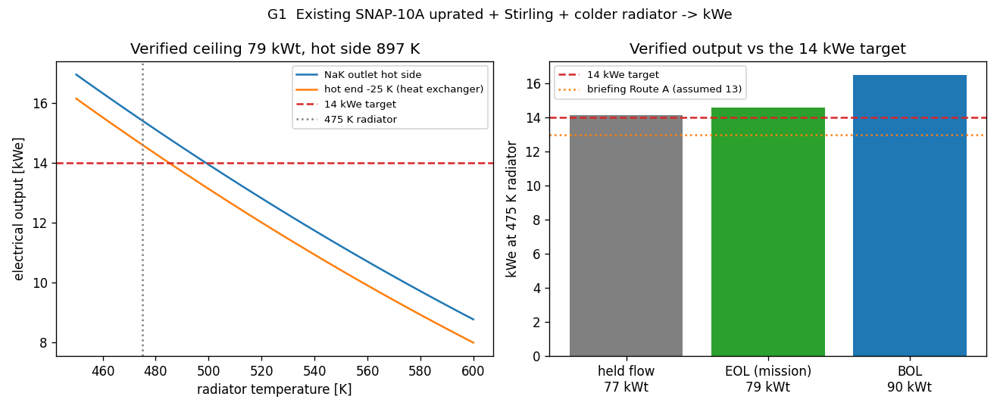

# Path to 14 kWe: the verified answer

This closes the question the project opened with, "does 14 kWe need a bigger reactor," using
the models built and validated across the workstream instead of the assumptions the earlier
briefing carried. The short answer: no. The existing SNAP-10A core, run to its verified
thermal-hydraulic ceiling with a Stirling converter and a colder radiator, reaches 14 kWe.
Model: `g1_uprate_to_kwe.py`, which chains the `heat_transport/uprate` thermal model to the
Stirling model.

## The chain, end to end

Every link is now a computed or sourced number, not an assumption:

1. **Thermal-hydraulic ceiling.** The coupled thermal model, with the measured radial peaking
   (1.317, from OpenMC) and the real EM pump curve (NAA-SR-11879, temperature-coupled), puts
   the fuel-limited ceiling at about **79 kWt** end-of-life (76 to 90 kWt across the flow
   policies). See `../heat_transport/uprate/`.
2. **Material limits confirmed.** The 970 K fuel wall (Simnad U-ZrH service limit) and 977 K
   clad limit (Hastelloy-N creep) are sourced, not placeholders, and fast fluence clears the
   clad and the beryllium reflector by orders of magnitude. See `Material_Life_F1.md`.
3. **Reactivity and control.** The core is self-regulating (-1.56 pcm/K) and the drums carry
   ~5925 pcm of worth, far more than the uprate needs. See `Phase2_Reactivity.md`.
4. **Hot side.** At the ceiling the NaK leaves the core at about **897 K** (the fuel runs to
   the 970 K wall, with a ~75 K fuel-to-coolant drop). After a ~25 K heat-exchanger drop the
   Stirling hot end sees about **872 K**, hotter than the earlier briefing assumed.
5. **Conversion.** The Stirling model at 872 K hot, a 475 K radiator, and 79 kWt gives
   **14.6 kWe** (20 percent overall), with a 26 m^2 radiator, ~178 kg, 82 W/kg.

*Figure G1. Left: electrical output versus radiator temperature at the verified 79 kWt
ceiling, with and without the heat-exchanger drop; 14 kWe is met at or below a 485 K radiator.
Right: all three uprate ceilings clear 14 kWe at a 475 K radiator, above the briefing's
assumed Route A.*

## The numbers against the requirement

| case | reactor | hot / cold | overall eff | output | radiator |
|---|---|---|---|---|---|
| flown thermoelectric | 34 kWt | 775 / 590 | 1.82% | 0.58 kWe | 5.8 m^2 |
| briefing Route A (assumed) | 85 kWt | 800 / 475 | 16.4% | 13.0 kWe | 29 m^2 |
| **verified, EOL mission** | **79 kWt** | **872 / 475** | **19.7%** | **14.6 kWe** | **26 m^2** |
| verified, begin-of-life | 90 kWt | 869 / 475 | 19.8% | 16.5 kWe | 29 m^2 |
| verified, SNAP radiator | 79 kWt | 872 / 590 | 11.4% | 8.4 kWe | 12 m^2 |

The verified case beats the briefing's Route A at lower reactor power (79 vs 85 kWt) because
the real hot side is hotter than the 800 K the briefing assumed: the fuel-limited ceiling
runs the NaK to ~897 K, and a hotter hot side lifts the efficiency. 14 kWe is met for any
radiator at or below about 485 K; the colder the radiator, the more margin (16 kWe at 450 K).

## What this reframes

The project opened with "14 kWe needs a bigger reactor," because SNAP's reactor at SNAP's
temperatures and thermoelectric converter caps at 7.6 kWe by Carnot. The workstream replaced
each soft assumption with a model result, and the conclusion flipped: **14 kWe needs the same
reactor run harder, plus a Stirling converter and a colder radiator.** The reactor does not
have to grow. It has to be uprated to ~79 kWt (which the fuel, coolant, pump, reactivity, and
materials all permit), the thermoelectric has to become a Stirling (the converter swap that
was always the largest single lever), and the radiator has to run colder (a Carnot lever paid
for in area).

## What it costs, and what is still open

Three honest costs. The radiator grows to ~26 m^2, about five times SNAP's, the price of the
colder cold side. The Stirling trades SNAP's no-moving-parts reliability for a dynamic machine
that must run untended for the mission, which is exactly the reliability problem SNAP avoided
in 1965; the KRUSTY answer (many small convertors with redundancy, one per heat path) should
be carried into any real design. And running the fuel hotter speeds hydrogen redistribution
~2-3x (F1), so the uprate trades mission length against power and the hydrogen life has to be
budgeted.

Two model items remain, neither of which threatens the result. The hot-side temperature and
peaking rest on the analytic and standalone-OpenMC models; the coupled Cardinal solve on the
PC is the capstone validation, especially for feedback-shifted peaking. And the EM pump curve
above 1000 F NaK is a short extrapolation (validated to the 1056 F flight point within ~6%).
Both are documented; both leave the ~14.6 kWe conclusion standing with margin.

## Files

- `g1_uprate_to_kwe.py` (this chain), `path14kwe_figs/figK4_verified_kwe.png`
- thermal ceiling: `../heat_transport/uprate/` (sweep, dossier, Phase2, F1)
- Stirling model: `stirling_cycle_concept/stirling_concept.py`
- superseded assumptions: `Path_to_14kWe_Briefing.md` (Route A's 85 kWt / 800 K / 13 kWe)
