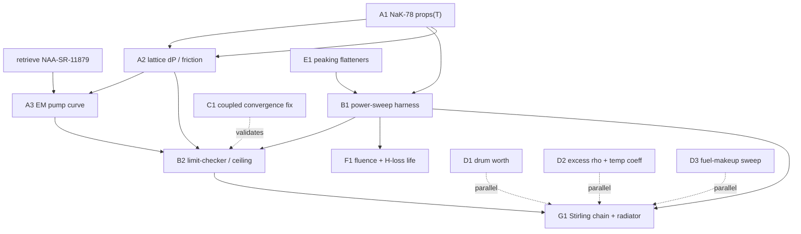

# Structural development roadmap: the 14 kWe uprate

Prepared June 2026. This is the build view of the same work the
`Power_Uprate_Verification_Roadmap.md` and `Path_to_14kWe_Briefing.md` describe as a
study. Those documents are organized by question (Phase 0 through 5). This one is
organized by artifact: the discrete model and code components that have to exist, what
each depends on, what it feeds, its current status against the codebase, and the test it
must pass to count as done. Use the verification roadmap for the scientific narrative and
this one to assign, sequence, and track the actual development.

## The build in one sentence

Everything reduces to making the uprate ceiling a computed number instead of the assumed
2 to 3x, and that requires building a coolant-and-pump physics layer the models do not yet
have, wrapping it in a power sweep that reads three limits, and chaining the answer into
the Stirling output. Reactivity, power flattening, and fluence life are parallel or
downstream refinements.

## Component register

Status key: **EXISTS** runs and is validated; **PARTIAL** the scaffolding or data is there
but the component itself is not written; **MISSING** nothing yet. Each component is a unit
of work with one acceptance test.

### Group A. Coolant and pump physics (the binding gap, critical path)

These three are the reason the uprate is an assumption rather than a result. None exist.
They are 1-D channel closures, which matters for the architecture decision below.

**A1. Temperature-dependent NaK-78 properties.**
Status: MISSING. Today both the Cardinal THM side and `hot_channel_analytic.py` use
room-temperature constants (`SimpleFluidProperties`, density flagged as a known gap in the
Layer 2 report). Build a NaK-78 property set, rho(T), cp(T), k(T), mu(T), over 600 to
1100 K, as a Python module for the analytic model and as a `(T)` fluid-properties object
for THM.
Depends on: nothing (data task).
Feeds: A2, B1, the trustworthiness of every off-design temperature.
Lives in: new `heat_transport/uprate/nak78_properties.py` and the THM input.
Acceptance: reproduces published NaK-78 property values at 3 temperatures within stated
tolerance, and the design-point run is unchanged at 34 kWt when evaluated at design T.

**A2. Tight-lattice pressure-drop and friction model.**
Status: MISSING. The P/D = 1.008 bundle is extremely tight, so friction and form losses
set the pumping head, and nothing currently charges flow any head at all.
Build a friction-factor plus form-loss model for the bundle that returns delta-P as a
function of mass flow and temperature.
Depends on: A1 (mu, rho enter Reynolds and the friction factor).
Feeds: A3 (the head the pump must overcome), B2 (the flow limit).
Lives in: `heat_transport/uprate/channel_hydraulics.py`.
Acceptance: delta-P at the design flow matches a hand calc from the bundle geometry and a
SNAP thermal-hydraulic reference within tolerance; delta-P rises monotonically with flow.

**A3. EM pump head-flow curve.**
Status: MISSING, and blocked on a document that is not yet retrieved. The pump capacity is
in NAA-SR-11879 (OSTI 4516323), flagged across the project as not-yet-pulled. Build the
pump curve, deliverable head as a function of flow, as a small data module.
Depends on: retrieving NAA-SR-11879.
Feeds: B2 (closes the flow limit: required flow versus deliverable head).
Lives in: `heat_transport/uprate/em_pump_curve.py` plus the retrieved report in the
bibliography.
Acceptance: the pump curve passes through the as-flown design flow at its rated head; the
intersection of pump-deliverable head and the A2 system curve reproduces the design flow.

### Group B. The uprate driver (critical path)

**B1. Power-sweep harness.**
Status: PARTIAL. `hot_channel_analytic.py` already takes `(p_core, f_radial, f_axial)` and
is parametric in power, so the spine exists; what is missing is the loop that marches power
up holding inlet at 755 K, recomputes flow against the pump, and tabulates the result with
A1 to A3 wired in.
Depends on: A1, A2, A3.
Feeds: B2, G1, F1.
Lives in: extend `hot_channel_analytic.py` or a thin `uprate/sweep.py` wrapper over it.
Acceptance: produces a power-versus-state table from 34 kWt upward where every column is
continuous and the 34 kWt row matches the Layer 2 design point (817.7 K hot side, 867 K
peak fuel).

**B2. Limit-checker and ceiling reader.**
Status: MISSING. At each swept power, evaluate the three limits and report the first one
that binds: peak fuel against the ~970 K hydride wall, peak clad against the Hastelloy-N
limit, and required NaK flow against the A3 pump deliverable into the A2 rising pressure
drop.
Depends on: B1, A2, A3, and the material limits (shared with F1).
Feeds: G1 (the maximum sustainable kWt and its hot-side temperature), and the Route A vs B
decision.
Lives in: `uprate/limit_check.py`.
Acceptance: returns one number, max sustainable kWt at 800 K, with the binding limit named;
matches the analytic fuel-only bound where the pump and clad are slack.

### Group C. Coupled-solve convergence (validation, not on the critical path)

**C1. Conjugate convergence fix.**
Status: PARTIAL. The full 37-pin coupled Cardinal solve is built but does not converge the
fluid to the solid (the stiff-HTC problem); Layer 2 was closed out analytically. The fix is
known and documented: warm-started `TransientMultiApp` plus interface-temperature
relaxation, tuned on the single pin first.
Depends on: the Layer 2 files as they stand.
Feeds: a 3-D validation of B1/B2 at the design point and at the ceiling, nothing else.
Lives in: `heat_transport/layer2_core/` per `Layer2_Fix_Notes.md`.
Acceptance: the coupled fluid closes on the solid's 34 kW at the design point and reproduces
the analytic hot-side and peak-fuel temperatures within tolerance.

### Group D. Reactivity and control (parallel, in snap.py)

**D1. Control-drum worth sweep.**
Status: PARTIAL. The four drums and their angles exist in `snap.py`
(`rotation_angle_c1..c4`, currently 94/-94 degrees), but there is no driver that rotates
them across their range and records reactivity. Build that sweep, modeled on the existing
`haleu_test` sweep scripts.
Depends on: `snap.py`.
Feeds: confirmation of shutdown margin and authority to hold the uprated power.
Lives in: `snap/run_drum_worth.py`.
Acceptance: produces a reactivity-versus-drum-angle curve with total swing and a stated
shutdown margin.

**D2. Excess reactivity and temperature coefficient at the uprate.**
Status: MISSING. Confirm the core stays critical with margin at uprated temperatures and
that the negative U-ZrH feedback is the expected magnitude (it is what the uprate fights).
Depends on: `snap.py` with temperature feedback.
Feeds: the reactivity budget for the uprate.
Lives in: `snap/run_temp_coeff.py`.
Acceptance: a signed, magnitude-checked temperature coefficient and an excess-reactivity
number at the uprated operating point.

**D3. Fuel-makeup loading sweep.**
Status: PARTIAL. The HALEU branch already has the `U_MULT` loading knob and a loading sweep
(`haleu_test/run_loading_sweep.py`); reuse it on the HEU core to quantify what higher
uranium loading adds to the reactivity budget and where under-moderation saturates it, with
a short H/Zr sensitivity alongside.
Depends on: the HALEU `U_MULT` tooling.
Feeds: the reactivity budget, the fuel-makeup contribution.
Lives in: `snap/run_makeup_sweep.py` adapted from `haleu_test`.
Acceptance: excess reactivity versus loading with the saturation point identified.

### Group E. Power flattening (depends on D tooling, feeds back into B)

**E1. Radial peaking flatteners.**
Status: MISSING. The 1.56x radial peak caps the reactor, so flattening it raises the average
power at the fixed hot-pin limit. Build two variants, per-ring fuel zoning and hot-channel
coolant orificing, and re-run the sweep with the flattened profile.
Depends on: `snap.py` variants (shares tooling with D), B1.
Feeds: a multiplier that stacks on the B2 ceiling.
Lives in: `snap/` zoning variants plus the orificing case in the sweep.
Acceptance: the extra average power available at the same peak-fuel temperature, quoted as
a multiplier.

### Group F. Material and fluence life (downstream of B)

**F1. Fluence and hydrogen-loss post-processor.**
Status: MISSING. From the uprated flux, compute fast fluence on the clad and reflector
against their damage limits and the hydrogen-loss rate of the hydride at the higher fuel
temperature. This is the constraint most likely to pull the achievable number down.
Depends on: B1 (the uprated flux and fuel temperature), the Hastelloy-N and U-ZrH limits
from Simnad and the hydride reports.
Feeds: the lifetime at the uprated power, and whether it meets the mission.
Lives in: `uprate/life_check.py` plus an OpenMC fast-flux tally in `snap.py`.
Acceptance: a fluence and a hydrogen-loss number at the ceiling power with a pass/fail
against the mission length.

### Group G. Output integration

**G1. Stirling chain and radiator sizing.**
Status: PARTIAL. `stirling_cycle_concept/stirling_concept.py` already carries the
temperature-dependent relative efficiency anchored to SNAP and Kilopower; what is missing
is the connector that feeds it the B2 ceiling power and hot-side temperature and sizes the
radiator and mass at the chosen cold side.
Depends on: B2.
Feeds: the verified kWe that replaces the assumed 13, with its radiator and mass cost and a
statement of which limit set the ceiling.
Lives in: `energy_conversion/uprate_to_kwe.py` over `stirling_concept.py`.
Acceptance: a single verified kWe with radiator area and mass, reproducing the briefing's
route table when fed the assumed ceiling, and replacing it when fed the computed one.

## Dependency graph

## Critical path and build order

The spine is **A1 to A2 to A3 to B1 to B2 to G1**. That chain, and only that chain, turns
the assumed uprate into a verified kWe. Everything else is parallel (D), a refinement that
stacks on the answer (E, F), or a 3-D validation of it (C).

Recommended sequence:

1. **A3 data retrieval first**, before any modeling. The pump curve is the single hardest
   dependency because it lives in a document nobody has pulled, and it gates B2. Pull
   NAA-SR-11879 now so a literature dead-end does not surface after the modeling is built.
2. **A1, then A2.** Properties before hydraulics, because Reynolds needs them.
3. **B1 and B2**, wiring A1 to A3 into the sweep. This is the result.
4. **G1** to read the verified kWe.
5. **D1 to D3 in parallel** in `snap.py` throughout, since they share no dependency with A.
6. **E1 and F1** once the ceiling exists, to refine it.
7. **C1** only if a 3-D coupled validation of the ceiling is wanted; the analytic close-out
   already covers the design point.

## Three recommendations, with reasons

**Build the coolant physics into the analytic model, not the coupled Cardinal solve, and
use Cardinal only to spot-validate.** The verification roadmap and the briefing both say
"run Phase 1 in the coupled Cardinal model." I think that is the wrong default for the
sweep, and here is why. A1 to A3 are all 1-D channel closures: properties, a friction
factor, and a pump curve. The pump-and-flow limit that actually bounds the uprate is a 1-D
channel energy-plus-momentum balance, not a 3-D conjugate problem, and `hot_channel_analytic.py`
already reproduces the design point cheaply and parametrically. The full coupled solve is,
by the Layer 2 report's own account, brutally stiff and does not yet converge. Gating the
entire uprate answer on fixing that stiffness is a large time sink for a result the analytic
model gives directly. The better structure: run the whole power sweep (B1, B2) in the
extended analytic model, then fix C1 and use the coupled Cardinal solve to validate two or
three points, including the ceiling, where temperature feedback could redistribute the
radial peaking in a way the 1-D model cannot see. That keeps the 3-D model honest about its
one real value-add (feedback-shifted peaking) without making it the bottleneck.

**De-risk A3 before committing to Route A at all.** The whole 14 kWe case leans on the
uprate multiplier, and the uprate is bounded by the pump, not the fuel. The pump capacity is
one unretrieved document. If NAA-SR-11879 cannot be found or the pump tops out low, Phase 1
cannot close with the real constraint and Route A (same-hardware uprate to ~85 kWt) may be
dead on arrival, which would put Route B (the hotter redesign) back as the primary path.
That is a big conclusion riding on a single data hunt, so it should be the first thing
resolved, not the last. If I cannot find the report, the fallback is an EM-pump scaling
estimate from the geometry and the known design flow, clearly flagged as an estimate.

**Give the uprate work a clean home.** `heat_transport/` already carries four parallel
single-pin and core copies (`two_way`, `layer1_cp_accel`, `layer1_transfer`, `layer2_core`)
plus loose scripts. Adding the uprate components as more loose files will make the workstream
hard to follow. Put A1 to B2, F1 in one `heat_transport/uprate/` directory with its own
short README, the same self-contained pattern as `haleu_test` and `stirling_cycle_concept`,
so the uprate study reads as one thing.

## What this roadmap does not change

The validation philosophy is unchanged: reproduce the 34 kWt design point first, then go
off-design. Every component's acceptance test above includes the design-point check for
exactly that reason. The science in the verification roadmap is intact; this only re-cuts
it into buildable, assignable, testable pieces and makes the call on where to build them.
