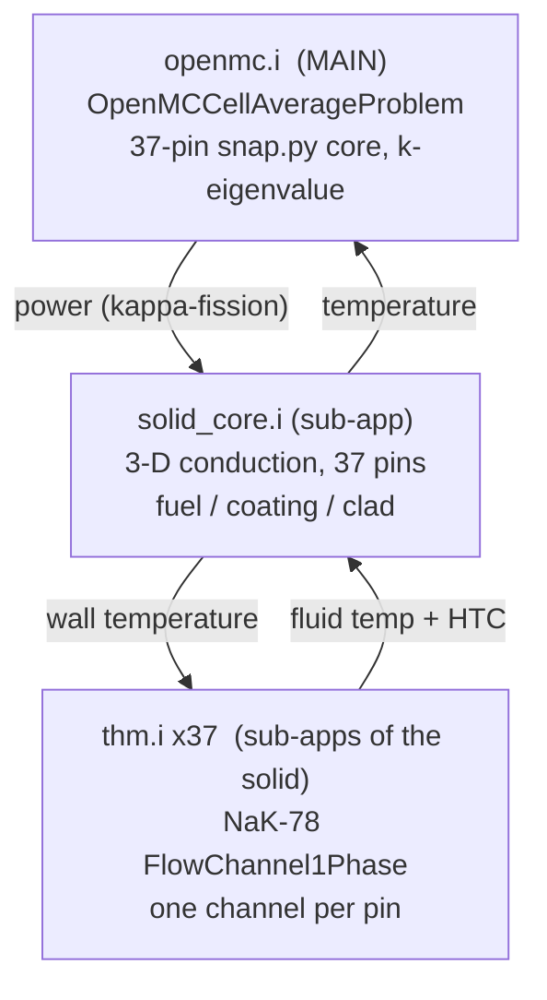
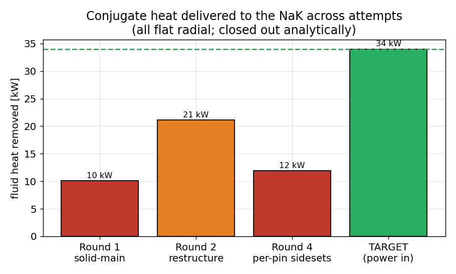
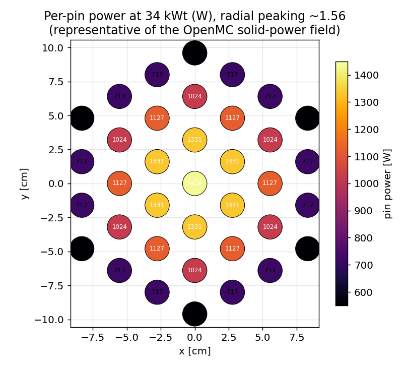
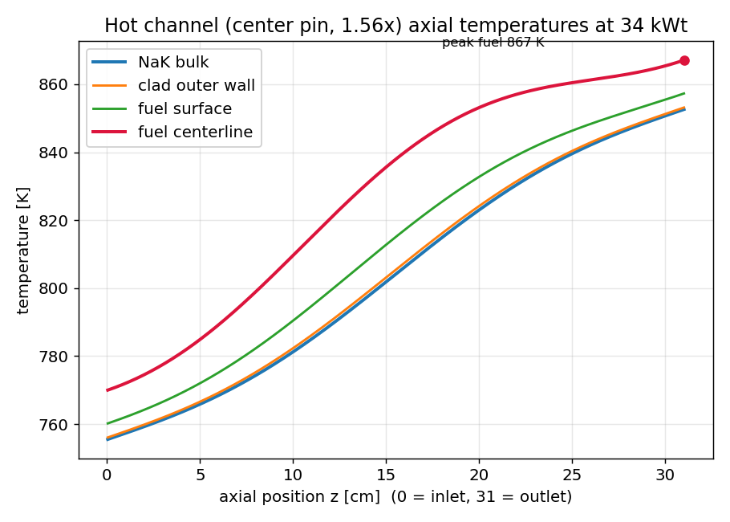
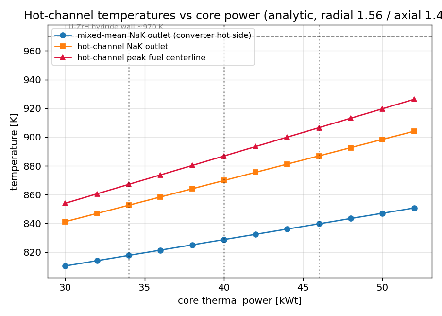

# Layer 2: full-core heat transport for SNAP-10A — report

Prepared June 2026 to document the entire Layer 2 effort: what it models, every
input and its source, the code that runs it, the problems found and fixed along the
way, and the result. The aim is that a colleague can read this, understand the model,
reproduce it, and explain it.

## 1. What Layer 2 is and why it exists

Layer 2 models the reactor-to-converter thermal path of the full 37-pin SNAP-10A
core. The chain is: OpenMC produces the fission heat in the fuel, a MOOSE
heat-conduction solve carries it through each pin (fuel, coating, clad), and the
MOOSE Thermal Hydraulics Module (THM) carries it away in the NaK-78 coolant. The
single output that matters downstream is the NaK outlet temperature, which is the
hot-side boundary condition for the separate Stirling and thermoelectric models in
`../energy_conversion`. The peak fuel temperature is the second output, because it
is the safety margin against the U-ZrH hydride limit (~970 K).

Layer 2 is the production step of a layered build. Layer 0 (the MVP) was one pin in
2-D, Layer 1 (`two_way/`) was one pin in 3-D with live OpenMC, and Layer 2 swaps the
single pin for the real 37-pin core coupled to the `snap.py` OpenMC model. The
layering exists so that a failure can be localized to one new piece rather than a
whole untested deck.

The recurring rule throughout: OpenMC supplies the *shape* of the heat (where fission
energy deposits, pin to pin and along the axis); the assumed core thermal power
(34 kWt at the design point) supplies the *magnitude*. The two combine at the
normalization.

## 2. Architecture

The coupling is three apps in a parent-child hierarchy. OpenMC is the main app; the
solid conduction is its sub-app; the 37 NaK channels are sub-apps of the solid.



This hierarchy was not the first attempt, and the reason it is shaped this way is in
Section 5. The short version: making OpenMC the main app and converging the cheap
solid-to-NaK loop underneath it is the documented Cardinal pattern (the gas_assembly
tutorial), and it is the only way the expensive Monte Carlo solve fires just a
handful of times instead of hundreds.

## 3. Inputs, full specification

Every physical input to the coupled model, with its value and source.

### 3.1 Geometry (per pin), from snap.py and arXiv 2505.04024 Table I

| quantity | symbol | value | note |
|---|---|---|---|
| fuel radius | r_fuel | 0.0153924 m | U-ZrH fuel meat |
| coating outer radius | r_coat | 0.0156210 m | coating/gap, 0.229 mm thick |
| clad outer radius | r_clad | 0.0158750 m | Hastelloy-N, 0.254 mm thick |
| active length | L | 0.310515 m | fuel column |
| lattice pitch | p | 0.0320040 m | hex, P/D = 1.008 (very tight) |
| pin count | N | 37 | 4 hex rings |
| heated perimeter | P_hf | 0.0997456 m | pi x 2 r_clad |
| clad outer area / pin | A_clad | 0.030973 m^2 | P_hf x L |

The mesh `core37.e` is built by `make_core_mesh.i`: the validated single-pin
cross-section (ConcentricCircleMeshGenerator, fuel/coating/clad rings, 32 azimuthal
sectors) copied to the 37 snap.py fuel coordinates with CombinerGenerator, extruded
30 layers axially, and centered on z so the core spans z in [-L/2, +L/2] to match
snap.py.

### 3.2 Coolant (NaK-78), from arXiv Table II

| quantity | value | note |
|---|---|---|
| per-channel mass flow | 0.0167541 kg/s | total core flow 0.6199 kg/s / 37 |
| specific heat cp | 879.903 J/kg-K | SimpleFluidProperties |
| density (room T) | 866 / 755.92 kg/m^3 | known gap: constant, not T-dependent |
| inlet temperature | 755.37 K | core inlet (cold leg) |
| heat-transfer coeff | 5.01e4 W/m^2-K | clad-to-NaK, constant |
| per-channel heat-capacity rate | 14.742 W/K | mdot x cp; a 919 W pin gives a 62 K rise |

### 3.3 Solid materials (conductivity), from k_of_T_sources.md / arXiv Table II

| block | k [W/m-K] | density | cp | source |
|---|---|---|---|---|
| fuel (U-ZrH) | 22.484 (constant) | 6000 | 300 | arXiv Table II; flat per Simnad |
| coating | 1.729 (constant) | 7400 | 400 | arXiv Table II; the low-k layer |
| clad (Hastelloy N) | 10.99 to 27.08, k(T) | 8860 | 578 | ORNL/MSDR correlation |

The clad conductivity is the only temperature-dependent property, a piecewise-linear
k(T) that reproduces arXiv Table II's 18.852 at ~800 K. The density and specific heat
are present but unused, because the steady solve carries no time derivative (Section 5).

### 3.4 Power and neutronics

| quantity | value | note |
|---|---|---|
| core thermal power | 34000 W | arXiv / shield design point |
| power vintage spread | 30 / 34 / 39.5-40 kWt | unresolved; FS-3 endurance ran ~40 |
| OpenMC particles/batch | 20000 | coupled march only; final k from a standalone high-stat solve |
| cell_level | 1 | resolves the 37 distinct pin universes |
| scaling | 100 | MOOSE metres to OpenMC cm |
| nuclear data | ENDF/B-VIII.0 (HDF5) | matches the validation policy |
| coupled k-effective | ~1.0006 (stable) | vs standalone fig12_test 1.00086 |
| radial peaking (hot pin / avg) | 1.56 | OpenMC solid-power field, ParaView |
| axial peaking (peak / avg) | 1.40 | extract_heat_source.py kappa-fission tally |

## 4. The code, chunk by chunk

Four files carry the model. Generated XML, meshes, and run outputs are not tracked;
the inputs below are.

### 4.1 `openmc.i` — the main app

The OpenMC problem reads the `snap.py` `model.xml`, tallies kappa-fission per pin, and
drives the outer Picard loop.

```
[Problem]
  type = OpenMCCellAverageProblem
  power = 34000.0          # magnitude; OpenMC supplies only the shape
  scaling = 100.0          # m -> cm
  cell_level = 1           # the 37 pin universes live one level below the lattice
  temperature_blocks = 'fuel coating clad'
  relaxation = constant
  relaxation_factor = 0.5  # damps the source feedback (gas_assembly setting)
  [Tallies]
    [heat_source]
      type = CellTally
      block = 'fuel'
      name = heat_source
    []
  []
[]
[MultiApps]
  [solid]
    type = FullSolveMultiApp   # run the solid+THM conjugate to completion each step
    input_files = 'solid_core.i'
    execute_on = timestep_end
  []
[]
[Transfers]
  [heat_to_solid]   # OpenMC kappa-fission -> solid 'power', integral preserved
    type = MultiAppGeneralFieldShapeEvaluationTransfer
    to_multi_app = solid
    source_variable = heat_source ; variable = power
    from_postprocessors_to_be_preserved = heat_source
    to_postprocessors_to_be_preserved = power_in
  []
  [temp_from_solid] # solid T -> OpenMC temperature feedback
    type = MultiAppGeneralFieldShapeEvaluationTransfer
    from_multi_app = solid ; source_variable = T ; variable = temp
  []
[]
[Executioner]
  type = Transient ; dt = 1.0 ; num_steps = 15   # 15 = Picard iterations, not time
[]
```

The `num_steps` is the outer Picard count, not physical time. One OpenMC eigenvalue
solve per step, relaxed by 0.5, converges the neutronics-temperature feedback in about
15.

### 4.2 `gen_per_pin.py` and `solid_core.i` — the solid and the NaK coupling

`solid_core.i` is generated by `gen_per_pin.py` from `pin_positions.txt`, because the
per-pin coupling needs 37 of everything and hand-writing it is error-prone. The
generator emits: the mesh with `'outer'` split into 37 per-pin clad sidesets, 37
single-channel `CoupledHeatTransfers` blocks, and 37 single-instance THM apps. Why
single-channel and not one shared coupling is the central finding of Section 5.

```
[Kernels]
  [conduction]  ; type = HeatConduction ; variable = T []     # steady conduction
  [source]      ; type = CoupledForce ; variable = T ; v = power ; block = fuel []
[]                                                              # no time derivative

# one of 37, generated:
[CoupledHeatTransfers]
  [p01]
    boundary = 'outer_p01'        # pin 1's own clad sideset
    T = T ; T_fluid = 'T_fluid' ; T_wall = T_wall ; htc = 'htc'
    multi_app = thm01             # pin 1's own single-instance NaK channel
    position = '0.0 0.0 -0.1552575'   # x,y of the pin, z = -L/2 (centered mesh)
    orientation = '0 0 1' ; length = 0.310515 ; n_elems = 30
  []
[]
[Executioner]                     # the conjugate inner loop
  type = Transient ; num_steps = 1 ; fixed_point_max_its = 50
  fixed_point_rel_tol = 1e-4 ; accept_on_max_fixed_point_iteration = true
[]
```

The mesh split, also generated, carves each pin's clad faces out of the single
`'outer'` sideset by proximity to that pin's centre:

```
[outer_p01]
  type = ParsedGenerateSideset
  input = core ; included_boundaries = 'outer'
  combinatorial_geometry = '(x - 0.0)^2 + (y - 0.0)^2 < 2.56e-04'   # within ~pitch/2
  new_sideset_name = 'outer_p01'
[]
```

A mesh-only check confirmed the carve is exact: 37 sidesets, 960 faces each,
37 x 960 = 35,520 = the original `'outer'`, no overlaps or gaps.

### 4.3 `thm.i` — one NaK channel

A single-phase FlowChannel1Phase along z, fed wall temperature from the solid and
returning the bulk fluid temperature and HTC. The conserving per-channel heat readout
is `ADHeatRateConvection1Phase`, which integrates the real wall flux rather than
differencing temperatures (Section 5 explains why that matters).

```
[heat_added]
  type = ADHeatRateConvection1Phase   # integral of Hw * P_hf * (T_wall - T)
  block = pipe ; P_hf = 0.0997456
[]
```

### 4.4 `hot_channel_analytic.py` — the analytic close-out

A per-channel energy balance plus 1-D radial conduction, taking the validated per-pin
power and returning the NaK outlet and the peak fuel temperature. This is what the
coupled solve reproduces at convergence, and it is the source of the final numbers in
Section 6. Parametric in core power and the radial and axial peaking factors.

## 5. What went wrong, and what it taught us

This is the part most worth reading, because the wrong turns are instructive and the
final architecture only makes sense against them.

**The convergence was paced by the coupling, not the physics.** The first full-core
runs took about three hours and did not reach steady state. Removing the solid time
derivative (the heat capacity term) barely changed anything, which proved the thermal
mass was never the bottleneck. The bottleneck was the loose, lagged coupling between
the three apps. The fix was structural: make OpenMC the main app with a clean
neutronics-then-solid-then-fluid sweep, which is the gas_assembly tutorial pattern.
That cut the expensive OpenMC solves from ~350 to ~15.

**The radial power looked flat, and the cause was not where it seemed.** Early runs
showed every channel removing almost identical heat, despite the core having real
radial peaking. The first hypothesis (the OpenMC `cell_level` collapsing the pins)
was wrong: ParaView confirmed the OpenMC heat source and the solid power are both
correctly peaked, about 1.56x center to edge. The flatness was downstream, in how the
NaK coupling partitioned the heat.

**The shared-boundary multi-channel coupling is an unsupported MOOSE mode.** The
original deck coupled one shared `'outer'` sideset to 37 channels with a positions
file. Reading the MOOSE source settled it: the `CoupledHeatTransfers` action is built
and tested for one channel on one axis; there is no test that partitions one boundary
across many position-keyed channels, and in practice it hands every channel the
whole-core-average wall temperature. That is why every channel removed exactly 1/37 of
the total. The fix is the only configuration MOOSE actually exercises: split `'outer'`
into 37 per-pin sidesets and give each its own single-channel coupling. The mesh check
confirmed the split is clean.

**The conjugate coupling is brutally stiff.** Even with per-pin sidesets, the coupled
fluid would not converge to the solid in a reasonable run. With an HTC of 5e4, the
solid sheds its heat across only a ~0.6 K wall-to-fluid gap, so the Picard iteration
has to nail the wall temperature to about 0.01 K to get the heat right, and it could
not from a cold start in the iterations available. The fluid kept landing at 12 to
21 kW against the solid's 34 kW.

The figure below tracks the heat delivered to the NaK across the attempts. It never
closed, and all of them stayed radially flat, which is what motivated the analytic
close-out.



**The close-out.** Because the neutronics and the per-pin power were validated, the
quantities that matter do not need the stiff coupled solve. The NaK outlet is a
per-channel energy balance and the fuel temperature is 1-D radial conduction, both
driven by the confirmed per-pin power. That is `hot_channel_analytic.py`, and it gives
the converged-equivalent answer directly. The coupled Cardinal model remains validated
on geometry, neutronics, and the per-pin sideset coupling; finishing its conjugate
convergence (warm-start plus interface relaxation) is a documented later step, not a
blocker on the result.

## 6. Results

### 6.1 Radial power

The OpenMC power is peaked about 1.56x from the central pin to the outer ring, the
expected shape for this small, leakage-bound core. The map below is representative of
the confirmed field (center ~1434 W, outer ring ~600 W, at 34 kWt).



### 6.2 Hot-channel axial temperatures

The hot channel is the central pin. The NaK rises monotonically to the outlet; the
fuel-to-coolant rise is modest (about 15 K), dominated by the low-conductivity coating
layer, not the fuel itself. The peak fuel centerline lands near the outlet because the
fluid heating dominates the conduction rise.



### 6.3 Headline numbers (34 kWt design point)

| quantity | value | feeds |
|---|---|---|
| mixed-mean NaK outlet | 817.7 K | the converter hot side (energy_conversion) |
| hot-channel NaK outlet | 852.6 K | hot-channel margin |
| hot-channel peak fuel centerline | 867 K | margin vs the ~970 K hydride wall |
| fuel-to-coolant rise (peak) | ~15 K | film 0.6 + clad 0.4 + coat 3.8 + fuel 9.8 K |

The mixed-mean outlet, 817.7 K, is unchanged from the single-pin MVP, as it must be,
because total power and total flow did not change. What Layer 2 adds is the hot-channel
and peak-fuel margins. The peak fuel of 867 K sits about 100 K below the hydride wall,
consistent with the design being heavily derated.

### 6.4 Scaling with core power

Because the core power is contested (34 vs ~40 vs ~50 kWt), the analytic result is
given across the range. Every temperature rises roughly linearly; the converter hot
side moves about 3 K per kWt.



| core power | converter hot side | hot-channel outlet | peak fuel |
|---|---|---|---|
| 34 kWt | 817.7 K | 852.6 K | 867 K |
| 40 kWt | 828.7 K | 869.8 K | 887 K |
| 46 kWt | 839.7 K | 886.9 K | 907 K |

Even at 46 kWt the peak fuel stays under the hydride wall, which is the first
quantitative hint that the existing core has thermal headroom, the question the 14 kWe
uprate study takes up.

## 7. Status: validated, and open

Validated: the OpenMC neutronics (coupled k stable near 1.0006), the per-pin power
distribution (peaked 1.56x), the OpenMC-to-solid heat transfer, the per-pin sideset
coupling (exact mesh carve), and the analytic hot-channel result.

Open: the coupled conjugate solve does not yet converge the fluid to the solid (the
stiff-HTC problem); the fix is warm-starting the solid and relaxing the interface
temperature, documented in `layer2_core/Layer2_Fix_Notes.md`. The NaK properties are
room-temperature constants (a known gap), and temperature-dependent NaK plus a
pressure-drop and pump model are prerequisites for the off-design uprate study.

## 8. Reproduce

```
# build the per-pin solid deck from positions
cd heat_transport/layer2_core && python gen_per_pin.py
# verify the mesh carve (expect 37 sidesets, 960 faces each)
cardinal-opt -i solid_core.i --mesh-only solid_check.e
# coupled run (moose env, model.xml present, OPENMC_CROSS_SECTIONS set)
mpiexec -np 10 ~/cardinal/cardinal-opt -i openmc.i --n-threads=2
# the analytic result that the run reproduces at convergence
cd .. && python hot_channel_analytic.py            # --power / --f-radial / --f-axial
```

## 9. Files

- `layer2_core/openmc.i`, `gen_per_pin.py` (-> `solid_core.i`), `thm.i`, `make_core_mesh.i`
- `layer2_core/Layer2_Fix_Notes.md` (the full debugging record and the warm-start fix)
- `hot_channel_analytic.py` (the analytic close-out, source of Section 6)
- `report_figs/` (the figures in this report)
