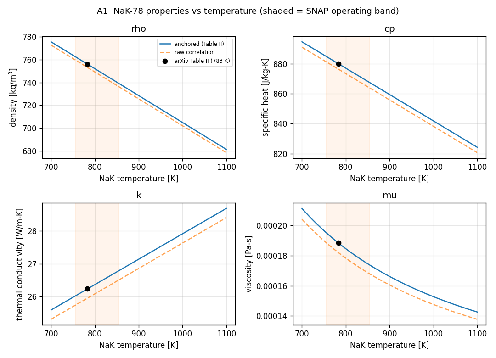
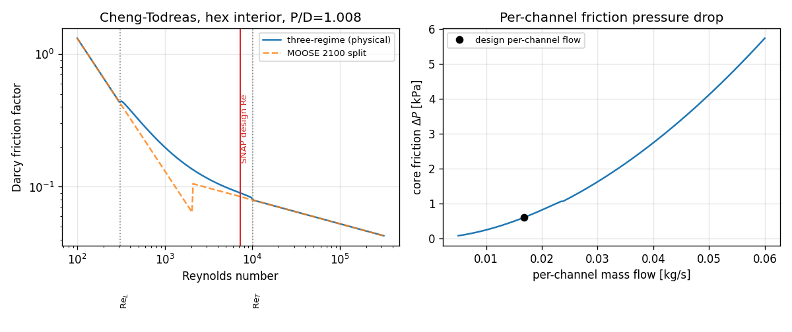
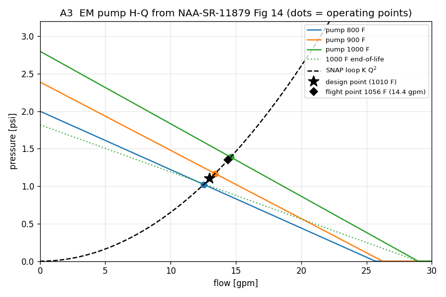
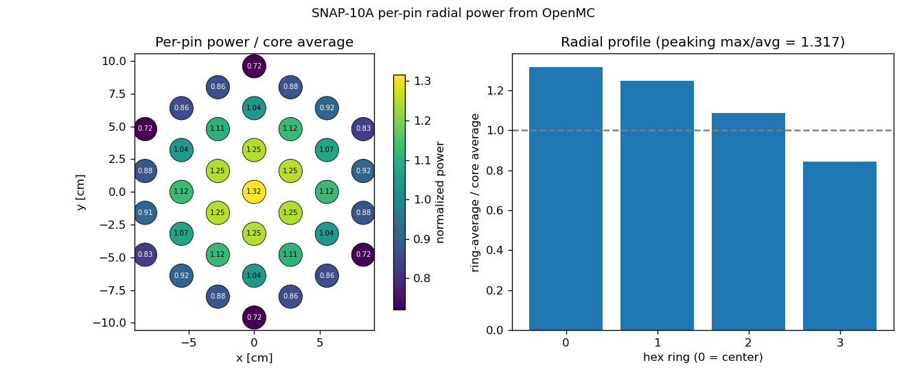
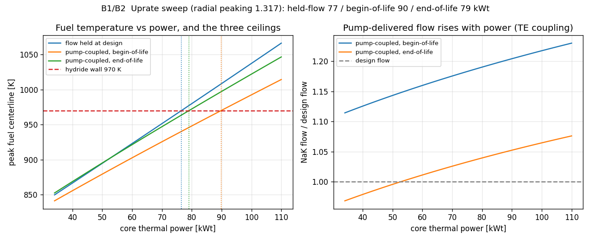
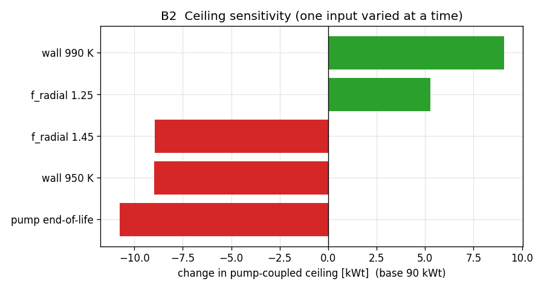

# Uprate study: implementation research dossier

Prepared June 2026. This is the research backing for the `uprate/` modules, the Group A
components of the structural roadmap (A1 NaK properties, A2 channel hydraulics, A3 EM
pump) plus the B1/B2 sweep that ties them. It records where every correlation, number,
and code pattern came from, so the modules can be trusted and a colleague can rebuild or
challenge them. Two implementation surfaces are covered for each component: the analytic
Python model in this folder (the recommended primary path) and the MOOSE/Cardinal path
for when the coupled solve is used to spot-validate.

## How to run

```
cd heat_transport/uprate
python3 nak78_properties.py     # A1 self-validation against arXiv Table II
python3 channel_hydraulics.py   # A2 self-validation against MOOSE Cheng-Todreas source
python3 em_pump_curve.py        # A3 pump H-Q model and design-point check
python3 sweep.py                # B1/B2 the uprate sweep and the preliminary ceiling
python3 sensitivity.py          # B2 how firm the ceiling is
python3 make_figures.py         # regenerate the figures in figs/ embedded below
```

All four are pure NumPy, no OpenMC or Cardinal needed, so they run on the Mac in any
Python with NumPy. The MOOSE syntax in this dossier is for the Cardinal heat_transport
model, not these scripts.

## Headline finding before the detail

The single most useful research result is that the MOOSE side of A1 and A2 is largely
built in. MOOSE ships a `NaKFluidProperties` object (eutectic NaK-78, temperature
dependent, from the same Foust 1972 handbook the project already cites) and an
`ADWallFrictionChengMaterial` plus a `cheng_todreas` closure that implement exactly the
tight-lattice rod-bundle friction A2 needs. So on the Cardinal side, A1 is a one-block
swap of `SimpleFluidProperties` for `NaKFluidProperties`, and A2 is selecting the
Cheng-Todreas closure with the right pitch-to-diameter. The Python modules here exist for
the analytic sweep, which is the recommended place to compute the uprate ceiling, and as
an independent cross-check of whatever the coupled model later produces.

---

## Component A1: temperature-dependent NaK-78 properties

### The physics gap

The models carried NaK as constants: cp = 879.903 J/kg-K in the analytic hot channel, and
on the Cardinal THM side a `SimpleFluidProperties` with a room-temperature density near
866 kg/m3. That 866 figure is the 20 C cold-fill density and is wrong for an 800 K loop by
about 13 percent. The uprate pushes outlet temperatures up, so the properties have to
move with temperature.

### Correlations adopted (analytic module)

NaK-78 is the sodium-potassium eutectic, 22 wt% Na / 78 wt% K, confirmed as the SNAP-10A
coolant in the Cardinal paper and the NASA EFF-TF lineage. T_C is Celsius, T_K is Kelvin.

| property | correlation | source |
|---|---|---|
| density | rho = 872.85 - 0.2349 T_C [kg/m3] | Garber & Godfroy (NASA, ICAPP'06), from NAA-SR-8617 |
| specific heat | cp = 965.9 - 0.1757 T_C [J/kg-K] | fit to Foust 1972 synopsis points |
| conductivity | k = 22.00 + 0.00775 T_C [W/m-K] | fit to Foust 1972 (note k RISES with T for NaK) |
| viscosity | mu = 6.925e-5 exp(756.6 / T_K) [Pa-s] | fit to Foust 1972, Arrhenius form |

A physics point worth carrying: NaK-78 thermal conductivity increases with temperature,
the reverse of pure sodium, because the alloy's room-temperature conductivity is depressed.
Any sanity check should expect k to go up across the 755 to 855 K band, not down.

### Anchoring to the validated baseline

The raw correlations reproduce the arXiv 2505.04024 Table II values at the design average
783.15 K to within about 1 percent for density, cp, and k, and 3.4 percent for viscosity.
To keep continuity with the v1.0-validated coupled model, the module's default `anchored`
mode shifts each correlation by a constant (multiplicative for the Arrhenius viscosity) so
it passes through the Table II value exactly at 783.15 K while carrying the literature
slope around it. Set `anchored=False` for the pure published correlation. The validation
print shows both columns.

Confirmation of the current constants: cp near 880 is correct for 783 K (it is the Table
II value); density should be near 755 at operating temperature, not 866; and the
conductivity 26.2 and viscosity 1.88e-4 the heat_transport model already carries are both
correct Table II values for 783 K. The room-temperature 866 should only ever appear as a
cold-fill density.



*Figure A1. NaK-78 properties over 700 to 1100 K. The anchored correlations pass through
the arXiv Table II points (black markers) and carry the literature slope; the raw
correlations (dashed) sit within 3 percent. The shaded band is the SNAP operating range.
Density falls from ~756 at design to ~700 at the Route B hot side, against the wrong
room-temperature 866 the model previously carried.*

### MOOSE/Cardinal path for A1

Use the built-in object. It is the eutectic, temperature dependent, and needs no code:

```
[FluidProperties]
  [nak]
    type = NaKFluidProperties   # eutectic NaK-78, properties from Foust/Bomelburg 1972
  []
[]
```

Then point the flow channel at it with `fp = nak`. Documented validity ranges cover the
SNAP band (density to 1100 C, viscosity above 100 C, conductivity 150 to 680 C, cp
measured 0 to 800 C); uncertainties are density 0.14 to 0.25 percent, k 0.8 percent, cp 0.4
to 5 percent. If a SNAP-specific correlation set is wanted instead of the built-in fits,
the no-code alternative is `TemperaturePressureFunctionFluidProperties` (feed rho, k, mu as
`ParsedFunction`s of temperature), or generate a CSV from this module's `write_moose_csv`
and read it with `TabulatedBicubicFluidProperties`. A custom C++ `SinglePhaseFluidProperties`
object is not justified when `NaKFluidProperties` exists.

Verified docs: the MOOSE FluidProperties index, the NaKFluidProperties page, the
TemperaturePressureFunctionFluidProperties page, and the TabulatedBicubicFluidProperties
page (links in the Sources section).

---

## Component A2: tight-lattice channel hydraulics

### The physics gap

The uprate is bounded by the coolant, not the fuel, so the flow has to be charged a
pumping head. Nothing in the project did this; flow was free. A2 gives the per-channel
friction pressure drop as a function of mass flow and temperature.

### Geometry, and the P/D = 1.008 resolution

The rod diameter for the coolant subchannel is the clad outer diameter, D = 2 R_clad =
0.031750 m, with hex pitch P = 0.0320040 m, giving P/D = 1.008. One research thread flagged
an apparent 1.0396, but that used the fuel-meat radius rather than the wetted clad surface.
The coolant sees the clad, so 1.008 is correct, and `hot_channel_analytic.py` already uses
R_clad = 0.0158750 consistently. The hex interior subchannel:

```
A_flow = (sqrt(3)/4) P^2 - (pi/8) D^2          = 47.65 mm^2
P_wet  = (1/2) pi D                             = 49.87 mm
Dh     = 4 A_flow / P_wet = D[(2 sqrt3/pi)(P/D)^2 - 1] = 3.82 mm
```

### Cheng-Todreas correlation (verified against MOOSE source)

```
f_Fanning = Cf / Re^n,   Cf = a + b (P/D - 1) + c (P/D - 1)^2,   f_Darcy = 4 f_Fanning
n = 1 (laminar),  n = 0.18 (turbulent)
```

Hexagonal interior subchannel, 1.0 <= P/D <= 1.1 coefficients:

| regime | a | b | c |
|---|---|---|---|
| laminar | 26 | 888.2 | -3334 |
| turbulent | 0.09378 | 1.398 | -8.664 |

At P/D = 1.008 these give Cf_laminar = 32.89 and Cf_turbulent = 0.1044. The coefficients
were taken from the MOOSE `ADWallFrictionChengMaterial.C` source and the module reproduces
the source's check value (laminar Cf = 62.075 at P/D = 1.05). The transition between the
P/D-dependent bounds ReL = 300 * 10^(1.7(P/D-1)) and ReT = 1e4 * 10^(0.7(P/D-1)) is blended
by the intermittency factor psi (the physical three-regime form). At P/D = 1.008, ReL = 310
and ReT = 10130, and the SNAP channel Reynolds number at design flow is about 7300, which
sits in the transition band, so the blend matters here.

One implementation subtlety found in the MOOSE source: the THM `ADWallFrictionChengMaterial`
does not implement the three-regime blend, it hard-splits at Re = 2100. The MOOSE SubChannel
module does implement the full transition. The Python module offers both: `mode='three_regime'`
(default, physical) and `mode='moose'` (the 2100 split, for exact agreement with a THM run).
Choose `moose` when cross-checking the coupled model, `three_regime` for the analytic answer.

### Validity at P/D = 1.008

This sits at the extreme tight edge of Cheng-Todreas (stated roughly 1.0 to 1.5), and the
bundle has 37 >= 19 pins, so it is inside range, but the near-touching laminar geometry
factor carries more uncertainty than the correlation's nominal 10 percent. A smooth-tube
Blasius or Churchill fallback on the hydraulic diameter is not safe here: at the SNAP
Reynolds number it under-predicts the friction factor by roughly a factor of three, because
a tight bare bundle has much higher friction than a smooth tube of the same Dh. Use it only
as an order-of-magnitude floor. Rehme's G* method is the parent of the Cheng-Todreas
bare-rod fit and agrees with it by construction.



*Figure A2. Left, the Cheng-Todreas Darcy friction factor for the SNAP interior subchannel:
the physical three-regime form and the MOOSE 2100-split form, with the transition bounds and
the SNAP design Reynolds number (~7300, in the transition band). Right, the per-channel
friction pressure drop versus mass flow with the design point. The bare-core friction is a
few hundred Pa, small against the 7.58 kPa pump head, so the loop resistance is dominated by
the converter and piping.*

### MOOSE/Cardinal path for A2

```
[Closures]
  [thm_closures]
    type = Closures1PhaseTHM
    wall_ff_closure  = cheng_todreas    # the rod-bundle friction law
    wall_htc_closure = mikityuk         # liquid-sodium rod-bundle HTC (better than a pipe Nu)
  []
[]
[Components]
  [pipe]
    type = FlowChannel1Phase
    fp = nak
    closures = thm_closures
    D_h = 3.822e-3
    # no f here, so the closure supplies the Cheng-Todreas factor
  []
[]
```

To impose the bundle correlation as a material directly, `ADWallFrictionChengMaterial` takes
`PoD`, `bundle_array = HEXAGONAL` (SNAP is a hex lattice, not square), and
`subchannel_type = INTERIOR`. Minor and form losses (grid, inlet, outlet) go in with
`FormLossFromFunction1Phase` and its per-unit-length `K_prime`. The liquid-metal heat
transfer closures available alongside (Lyon, Kazimi-Carelli, Mikityuk, Schad) are the
physically correct Nusselt laws for NaK and are likely a better choice than whatever the
current deck uses.

---

## Component A3: EM pump head-flow curve

### The report (retrieved June 2026)

The pump report is NAA-SR-11879, "SNAP-10A Thermoelectric Pump. Final Report", K. A. Davis,
Atomics International, 15 July 1966, OSTI record 4516323. The fetch tool returns empty bodies
(the scan is rendered in a JS viewer), but the full 86-page scan loads in a browser, and it
was read there. The relevant page is Figure 14 (p. 24), "Pressure vs Flow at Indicated NaK
Temperatures for Pump SN-010", which gives the pump H-Q curves at three NaK temperatures, the
SNAP-10A system resistance curve, and the design point. Figure 13 (p. 23) gives the
equivalent electrical circuit (total current, counter-EMF, channel and wall resistances),
confirming the DC-conduction back-EMF mechanism. Table 2 (p. 51) holds the detailed
single-pump data and is the next thing to mine if a finer model is wanted.

### The data, digitized from Figure 14

The pump is a DC conduction (Faraday/Lorentz) EM pump driven by thermoelectric elements
(B = 0.24 T, duct 25.4 x 87.6 x 10.16 mm, 534 A at 0.32 VDC, per Davis 1966 via El-Genk
2023). Figure 14 plots developed pressure (psi) versus flow (gpm) as three roughly linear,
descending lines at 800, 900, and 1000 F NaK, plus the rising SNAP-10A system curve and the
design point. Digitized to dP = stall - slope x Q:

| NaK temp | stall head | short-circuit flow | slope |
|---|---|---|---|
| 800 F (700 K) | 2.00 psi (13.8 kPa) | 25.7 gpm | 0.078 psi/gpm |
| 900 F (755 K) | 2.39 psi (16.5 kPa) | 26.2 gpm | 0.091 psi/gpm |
| 1000 F (811 K) | 2.80 psi (19.3 kPa) | 29.0 gpm | 0.097 psi/gpm |

Design point: 13 gpm at 1.1 psi for 1010 F NaK, i.e. 3 m3/hr at 7.58 kPa. This matches the
loop side (arXiv Table II 0.6199 kg/s / 755.92 = 2.95 m3/hr = 13.0 gpm) and El-Genk's 1.10
psi. The design point is a system REQUIREMENT on the rising loop curve; the 1000 F pump curve
sits above it, so the pump runs with margin (its operating-point intersection with the loop
curve is near 14.6 gpm).

### The finding that matters for the uprate

Pump performance rises strongly and monotonically with NaK temperature: the stall head climbs
about 0.4 psi per 100 F (2.0 to 2.8 psi over 800 to 1000 F). This is the thermoelectric
coupling made quantitative. The pump is driven by TE elements whose output grows with the
NaK (hot-junction) temperature, so a hotter core both needs more pumping AND gets it. When the
reactor is uprated the NaK runs hotter, the Figure 14 curve lifts, and the pump delivers more
flow on its own. This replaces the earlier half-stall placeholder, which underestimated both
the stall head and this temperature lever.



*Figure A3. The EM pump H-Q curves digitized from NAA-SR-11879 Figure 14, reproduced
analytically. The three solid lines are the pump at 800, 900, and 1000 F NaK (performance
rises with temperature), the dotted line is the 1000 F curve after end-of-life degradation,
and the dashed parabola is the SNAP loop resistance. Dots are the operating points where the
pump meets the loop; the star is the design requirement and the diamond the 1056 F flight
point. The operating flow climbs as the core runs hotter, which is the lever the uprate
gets.*

### Above 1000 F, and the life effect (report pp. 51-52, Figures 33-34)

The measured Figure 14 curves stop at 1000 F NaK, which is essentially the pump's
qualification ceiling. The uprate runs hotter (the ceiling outlet is near 1110 F), so the
high end is an extrapolation. Two findings from the flight-test section pin it down:

- A measured operating point above the curve ceiling: in flight (FS-4), at passive control the
  NaK was 1056 F and the pump delivered 14.4 gpm. The model's extrapolation gives 15.2 gpm
  there, about 6 percent high, so the extrapolation is validated to 1056 F and is mildly
  optimistic. The uprate ceiling sits only about 56 F above this measured point.
- Life degradation: Figure 33 shows the delivered flow falling from about 14.3 gpm to 12.5 gpm
  over roughly 9000 hours at a constant 1010 F NaK, about a 13 percent flow loss over the
  mission from thermoelectric power degradation (spec minimums were 13.2, 11.2, 10.4 gpm at
  start, 90 days, 1 year). `em_pump_curve.py` carries this as `EOL_HEAD_FACTOR`, calibrated so
  the end-of-life operating flow reproduces the 12.5 gpm point.

### The model

`em_pump_curve.py` interpolates stall(T) and slope(T) from the three digitized curves,
gives `pump_head(Q, T)` in SI, and finds the operating point as the intersection of the pump
curve with the loop resistance dP_loop = K Q^2 (K from the design point). For the uprate the
sweep iterates this against the core outlet temperature (the coupling), so the delivered flow
is an output, not an assumption, and a `head_factor` switches between begin-of-life and
end-of-life pump performance. The geometric scaling lever, if a stronger pump is ever wanted,
is stall head = B I / b, linear in magnetic field and drive current.

---

## B1 / B2: the sweep and the preliminary reading

`sweep.py` marches reactor power up and reads the fuel and clad temperatures, under two flow
policies: flow held at the 0.62 kg/s design value, and flow set by the real Figure 14 pump
curve coupled to the core outlet temperature (the thermoelectric coupling, iterated to
convergence). It reproduces the 34 kWt design point (mixed outlet 817.9 K against the target
817.7), which is the acceptance test.

### Radial peaking, now measured not assumed

The radial peaking was the second-largest lever on the ceiling, and it is now measured rather
than borrowed. `extract_pin_power.py` ran the snap OpenMC model (fig12_test, 1,000,000
particles x 100 batches) and reduced the kappa-fission field to per-pin powers: the hot pin /
average pin is **1.317**, with a clean monotonic radial profile (center 1.32, ring 1 ~1.25,
ring 2 ~1.08, ring 3 corners ~0.72).



*Figure B0. Measured per-pin power from the OpenMC model, normalized to the core average, and
the ring-average radial profile. The hot pin is the center at 1.317x, not the 1.56 the sweep
first used.*

This is below the 1.56 the sweep had borrowed from the Layer 2 report, and the gap is
instructive. The 1.56 was a local power-DENSITY peak read off the 3-D field, which folds in
axial peaking; this sweep applies the axial factor (1.40) separately, so the correct radial
factor is the pin-integrated 1.317. Using 1.56 double-counted axial peaking and was
over-conservative by about 18 percent on the hot-pin power. The measured 1.317 is the right
number, and it raises every ceiling. (At 34 kWt the peak fuel is now 850 K, against the 867 K
Layer 2 reported with 1.56; the core is even more derated than thought.)

### Three ceilings

With the measured peaking and the real pump curve:

| flow policy | fuel-limited ceiling |
|---|---|
| flow held at design | 76.5 kWt |
| pump-coupled, begin-of-life | 89.8 kWt |
| pump-coupled, end-of-life | 79.1 kWt |

The temperature lever in the pump curve is worth about +13 kWt over the held-flow case, and
the pump's mission-life degradation (the ~13 percent flow loss from Figure 33) takes about
11 of that back. So the mission-relevant number, what a design must meet for a year, is about
**79 kWt end-of-life**, up from the ~66 kWt the assumed 1.56 peaking gave. The correction was
worth roughly 13 kWt, all in the favourable direction, and it firmly tilts the reading toward
"same reactor run harder" being viable rather than the redesign being forced.

What is left to move the number: the clad and fuel temperature limits are placeholders pending
component F1; the pump curve above 1000 F is extrapolated (validated against the 1056 F flight
point to within 6 percent, mildly optimistic); and the measured peaking is the static
beginning-of-cycle field, so a Cardinal run with temperature feedback could still redistribute
it slightly at the uprated power. None of these is likely to move the ~79 kWt by more than a
handful.



*Figure B1. Left, peak fuel centerline versus core power for the three flow policies, against
the 970 K hydride wall; the crossings are the three ceilings. Right, the pump-delivered flow
rising with power through the thermoelectric coupling, at begin-of-life and end-of-life.
End-of-life starts below the design flow because the degraded pump delivers less.*



*Figure B2. How the pump-coupled ceiling moves as one input is varied around the begin-of-life
base. The pump's end-of-life degradation is the largest single downside; the residual radial
peaking band and the hydride-wall value are the next. With the peaking now measured, the
remaining swing is dominated by the pump life and the temperature limits.*

## Sources

NaK-78 properties:
- O. J. Foust (ed.), Sodium-NaK Engineering Handbook Vol. I, Gordon & Breach / USAEC, 1972.
  https://www.osti.gov/biblio/4631555 (scan: https://www.osti.gov/servlets/purl/4631555)
- A. Garber, T. Godfroy (NASA MSFC), ICAPP'06 Paper 6389, NaK-78 density fit.
  https://ntrs.nasa.gov/api/citations/20060025550/downloads/20060025550.pdf
- M. Dalinger et al., Multiphysics Modeling of SNAP 10A/2 with Cardinal, NETS 2025,
  arXiv:2505.04024, Table II. https://arxiv.org/abs/2505.04024
- J. P. Kotze et al., NaK as a primary heat transfer fluid (cross-check).
  https://sterg.sun.ac.za/wp-content/uploads/2012/10/Kotze-HTF1.pdf

MOOSE / THM implementation:
- FluidProperties index: https://mooseframework.inl.gov/syntax/FluidProperties/index.html
- NaKFluidProperties: https://mooseframework.inl.gov/source/fluidproperties/NaKFluidProperties.html
- TemperaturePressureFunctionFluidProperties:
  https://mooseframework.inl.gov/source/fluidproperties/TemperaturePressureFunctionFluidProperties.html
- TabulatedBicubicFluidProperties:
  https://mooseframework.inl.gov/source/fluidproperties/TabulatedBicubicFluidProperties.html
- FlowChannel1Phase: https://mooseframework.inl.gov/source/components/FlowChannel1Phase.html
- Closures1PhaseTHM: https://mooseframework.inl.gov/source/closures/Closures1PhaseTHM.html
- ADWallFrictionChengMaterial:
  https://mooseframework.inl.gov/source/materials/ADWallFrictionChengMaterial.html
- FormLossFromFunction1Phase:
  https://mooseframework.inl.gov/source/components/FormLossFromFunction1Phase.html

Cheng-Todreas:
- N. Todreas, M. Kazimi, Nuclear Systems Vol. I (3rd ed.), Eqs. 9.105/9.109, Tables 9.5.
- Cheng & Todreas, Nucl. Eng. Des. 92 (1986) 227.
  https://www.sciencedirect.com/science/article/abs/pii/0029549386902499
- MOOSE source ADWallFrictionChengMaterial.C (coefficients):
  https://raw.githubusercontent.com/idaholab/moose/master/modules/thermal_hydraulics/src/materials/ADWallFrictionChengMaterial.C

EM pump:
- NAA-SR-11879, K. A. Davis (Atomics International), "SNAP-10A Thermoelectric Pump. Final
  Report", 15 July 1966. Record https://www.osti.gov/biblio/4516323 ; the 86-page scan loads
  at https://www.osti.gov/servlets/purl/4516323 in a browser. Figure 14 (p. 24) is the H-Q
  data digitized in em_pump_curve.py; Figure 13 (p. 23) the equivalent circuit; Table 2
  (p. 51) the detailed single-pump data, not yet mined.
- El-Genk et al., miniature DC EM pump (cross-check of the design point and H-Q model):
  https://www.osti.gov/servlets/purl/2424215
