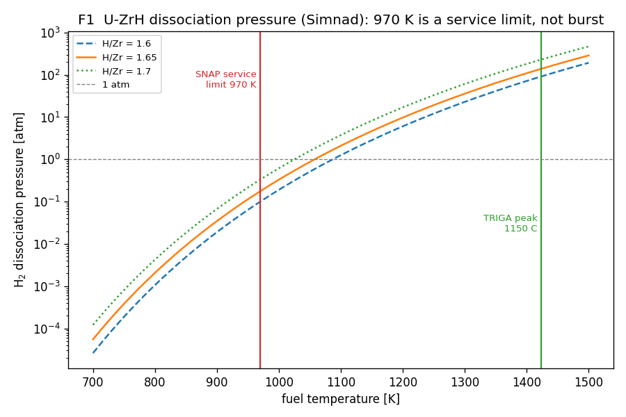
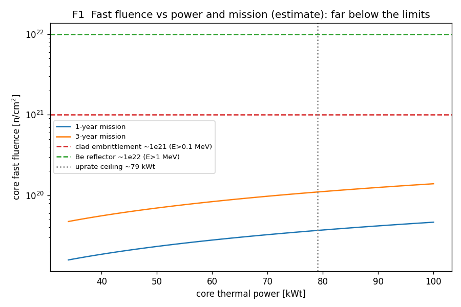
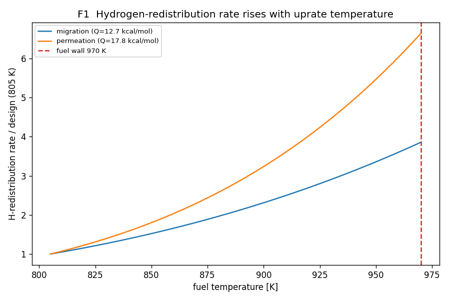

# Component F1: material and fluence life at the uprated power

The ~79 kWt end-of-life uprate ceiling is set by two temperature walls (970 K fuel,
977 K clad) that were placeholders until now, and it implicitly assumed the parts survive
the mission. F1 confirms both walls against the literature and checks the irradiation life.
The result strengthens the ceiling: the walls are real and sourced, fast fluence is nowhere
near limiting even at the uprate, and the one genuine life cost of running hotter is
accelerated hydrogen redistribution in the hydride, which is exactly what limited the real
SNAP-10A. Model: `life_check.py` (pure NumPy, runs on the Mac).

## The fuel wall (970 K) is a service limit, and it holds

SNAP-10A fuel is U-ZrH, ~10 wt% uranium (93 wt% HEU), hydrided to H/Zr about 1.65, the
single-phase delta hydride. The governing limit is not melting or hydride decomposition; it
is the equilibrium hydrogen dissociation pressure, which pressurizes the gap and stresses the
clad. The Simnad correlation gives that pressure as a function of temperature and H/Zr:

```
log10(P_atm) = K1 + K2 * 1e3 / T(K)
K1 = -3.8415 + 38.6433 X - 34.2639 X^2 + 9.2821 X^3
K2 = -31.2982 + 23.5741 X -  6.0280 X^2          (X = H/Zr)
```

`life_check.py` reproduces Simnad's isochores (0.11 atm at 700 C and 91 atm at 1150 C for
X=1.6, matching the published values). At the SNAP fuel composition the dissociation pressure
is small across the operating band and only reaches ~0.18 atm at the 970 K wall.



*Figure F1-1. U-ZrH dissociation pressure versus fuel temperature. The 970 K SNAP wall sits
at ~0.2 atm, three orders of magnitude below the ~140 atm at TRIGA's 1150 C peak-fuel limit.*

So 970 K is the documented SNAP sustained-service ceiling (Simnad records the glass-enamel
coated SNAP fuel "used successfully at temperatures up to 700 C"), set by the combination of
clad creep, hydrogen permeation, and hydrogen redistribution over a year, with large margin
against acute clad burst. TRIGA's higher ~1150 C limit is for robust-clad, transient-peak
fuel where the pressure reaches ~100-230 atm. The contrast is why 970 K is the right wall for
a year-long SNAP mission and also why the core has real thermal headroom below it. One honest
note: the arXiv Cardinal paper never states a fuel limit (its computed peak fuel is 853 K), so
970 K is a conservative engineering choice grounded in Simnad and the SNAP program, not lifted
from the paper.

## The clad wall (977 K) is confirmed, coincident with the fuel wall

Hastelloy-N (INOR-8), the SNAP clad, is a solid-solution Ni-16Mo-7Cr-4Fe alloy with no
gamma-prime strengthening, so its long-term ceiling is 704 C = 977 K, set by creep-rupture
strength rolloff (Haynes/ASME; ~83 MPa 10,000-hour rupture stress at 704 C). That is within
7 K of the fuel wall, so the fuel and clad temperature limits are effectively the same
constraint, and the sweep's fuel-limited ceiling already captures it (fuel binds first).

## Fast fluence is not life-limiting, even at the uprate

SNAP-10A is a very low power-density core (34 kWt in ~12 L), so the in-core fast flux is only
about 1e11 to 1e12 n/cm2-s, and a one-year design mission accumulates of order 1e19 n/cm2
fast. Scaling flux with power to the uprate and checking against the damage limits:

| case | core fast fluence | vs clad ~1e21 (E>0.1 MeV) | vs Be ~1e22 (E>1 MeV) |
|---|---|---|---|
| 34 kWt, 1 yr | ~1.6e19 | x63 margin | x630 margin |
| 79 kWt, 1 yr | ~3.7e19 | x27 margin | x270 margin |
| 79 kWt, 3 yr | ~1.1e20 | x9 margin | x90 margin |



*Figure F1-2. Core fast fluence versus power and mission length against the Hastelloy-N
embrittlement threshold (McCoy, ORNL-TM-3063) and the beryllium reflector limit. Even the
uprated core over three years stays an order of magnitude under the clad limit.*

The clad embrittlement threshold (~1e21 n/cm2, helium-driven, from the ORNL MSR surveillance
data) and the beryllium reflector swelling limit (~1e22 n/cm2) both sit far above what an
uprated SNAP core accumulates. Fluence does not cap the uprate. (The flux here is an estimate
from power and geometry; an OpenMC energy-filtered tally on fig12_test would pin it, but the
margins are large enough that the conclusion is robust to the uncertainty.)

## The real life cost of the uprate: hydrogen redistribution

What the uprate does cost is hydrogen behavior. Running the fuel hotter accelerates the
in-hydride hydrogen migration and the permeation loss through the clad, both Arrhenius in
temperature. Relative to the ~805 K design-average fuel temperature:



*Figure F1-3. Hydrogen-redistribution rate versus fuel temperature, relative to the design
average. At the uprated average fuel temperature (~890 K) the rate is ~2-3x the design rate.*

This is the mechanism that actually limited SNAP-10A: after about a year, hydrogen
redistribution pulled the outlet temperature down more than expected. Uprating raises the fuel
temperature and so speeds that redistribution by roughly two to three times at the uprated
average, shortening the hydrogen-limited life proportionally. It is the reason to hold the fuel
under the 970 K wall, and it is the constraint a long-mission uprate must budget for, more than
fluence or acute clad stress.

## F1 reading

The uprate ceiling rests on confirmed, sourced limits, not placeholders: 970 K fuel (Simnad,
SNAP service) and 977 K clad (Hastelloy-N creep), effectively the same wall. Fast fluence
clears the clad and the beryllium reflector by one to three orders of magnitude even at the
uprated power, so irradiation damage is not a constraint. The binding life consideration is
hydrogen redistribution, which accelerates ~2-3x at the uprated fuel temperature and sets the
real trade between uprate power and mission length. None of this lowers the ~79 kWt ceiling;
F1 confirms it and identifies hydrogen life, not fluence, as the thing to watch.

## Sources

- M.T. Simnad, "The UZrH_x alloy: its properties and use in TRIGA fuel," Nucl. Eng. Des. 64
  (1981) 403-422. Dissociation-pressure correlation, the 700 C SNAP service note, hydrogen
  permeation and migration rates. Scan: https://www.nrc.gov/docs/ML2005/ML20052A506.pdf
- H.E. McCoy, "An Evaluation of the MSRE Hastelloy N Surveillance Specimens - Fourth Group,"
  ORNL-TM-3063 (1971). Fast-fluence (>50 keV) 1.1e21 n/cm2 embrittlement data at 650 C.
  https://moltensalt.org/references/static/downloads/pdf/ORNL-TM-3063.pdf
- INL/EXT-18-45171, "Status of Metallic Structural Materials for Molten Salt Reactors":
  Hastelloy-N 704 C limit, helium embrittlement, MSBR <1e21 n/cm2 (E>0.1 MeV) design fluence.
  https://art.inl.gov/ART%20Document%20Library/High%20Temperature%20Materials/45171%20Status%20of%20Metallic%20Structural.pdf
- Haynes International, HASTELLOY N: 704 C (1300 F) approval, composition, creep-rupture.
  https://haynesintl.com/en/alloys/alloy-portfolio/corrosion-resistant-alloys/hastelloy-n/
- Beryllium irradiation (swelling/embrittlement band 1-6e22 n/cm2, E>1 MeV): Kupriyanov et al.,
  J. Nucl. Mater., https://www.sciencedirect.com/science/article/abs/pii/S0022311596000426 ;
  ANL/RTR/TM-20/1 MURR reflector lifetime, https://publications.anl.gov/anlpubs/2020/09/163045.pdf
- M. Dalinger et al., "Multiphysics Modeling of SNAP 10A/2 with Cardinal," arXiv:2505.04024
  (fuel composition, 853 K peak fuel, no stated limit). https://arxiv.org/abs/2505.04024
