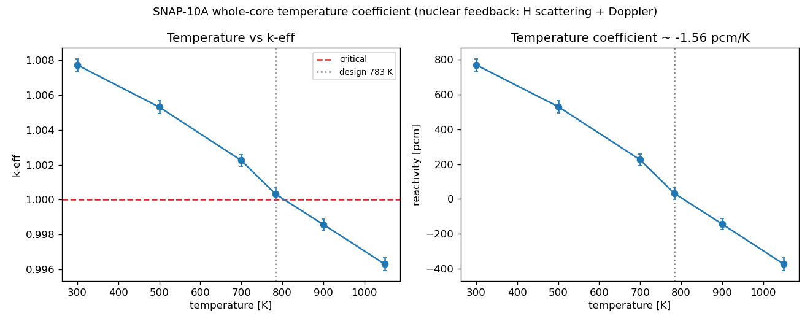
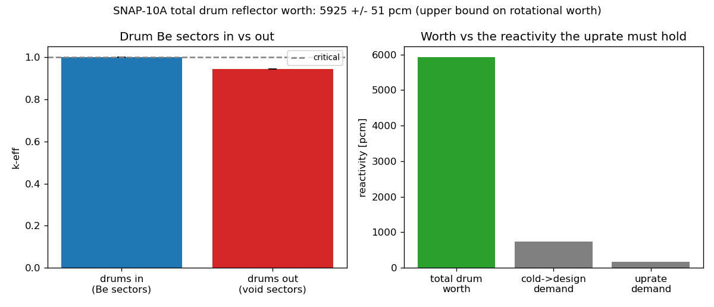

# Phase 2: reactivity and control for the uprate

Phase 2 of the verification roadmap asks whether the existing SNAP-10A core has the
reactivity feedback and the control authority to run and hold the uprated power. Two OpenMC
studies on the fig12_test operating model answer it: the whole-core temperature coefficient
(the feedback the uprate fights) and the control-drum worth (the authority to hold the power
and to shut down). Both run through env knobs added to `snap.py` (`TEMP_K`, `DRUM_FILL`,
`DRUM_DELTA`), all defaulting to the validated baseline. Scripts: `snap/run_temp_coeff.py`
and `snap/run_drum_total.py`.

## Temperature coefficient: negative and self-regulating

Sweeping the whole-core cross-section temperature from 300 to 1050 K (ENDF/B-VIII.0
interpolation), reactivity falls monotonically:

| T [K] | k-eff | reactivity [pcm] |
|---|---|---|
| 300 | 1.00773 | +767 |
| 500 | 1.00532 | +529 |
| 700 | 1.00225 | +225 |
| 783.15 | 1.00033 | +33 |
| 900 | 0.99858 | -142 |
| 1050 | 0.99630 | -371 |

The coefficient is about **-1.56 pcm/K**, clearly negative, the U-ZrH prompt feedback (the
hydrogen thermal-scattering law shifting with temperature, plus Doppler in U-238) that makes
the reactor self-regulating. The 783.15 K point reproduces the validated fig12_test k-eff
(1.00033), which confirms the `TEMP_K` knob is faithful. A negative coefficient is favourable
for the uprate: a hotter, uprated core is more stable, not less.

*Figure P2-1. k-eff and reactivity versus whole-core temperature. Monotonic and negative;
critical near the 783 K design point.*

What it sets is the reactivity the control system must accommodate. From cold (300 K) to the
design point (783 K) the core sheds about **734 pcm**; from the design point to a roughly
900 K uprated condition it sheds another **175 pcm**, so about **910 pcm** of temperature
swing from cold to the uprated state. The drums (and the burnup excess reactivity) must cover
this.

One honest caveat: `TEMP_K` moves only the cross-section temperature, so this is the nuclear
feedback (hydrogen scattering plus Doppler), which dominates in U-ZrH. The coolant-density and
thermal-expansion terms are not in this number and would make the full operational coefficient
somewhat more negative.

## Drum worth: ample authority

The four beryllium reflector drums are the control element. Their rotational worth could not
be measured by rotating them: the drum geometry is only valid near the operating orientation
(large rotations lose particles), and within the small valid window the reactivity moves only
about 100 pcm, inside the Monte Carlo noise. So the worth is measured instead by a material
swap at the baseline orientation: the Be sectors present (`DRUM_FILL=be`, the baseline) versus
empty (`DRUM_FILL=void`, the sectors removed, drums effectively rotated out).

| drum state | k-eff | reactivity [pcm] |
|---|---|---|
| in (Be sectors) | 1.00033 | +33 |
| out (void sectors) | 0.94436 | -5892 |

The total drum reflector worth is about **5925 +/- 51 pcm**, roughly $8 at a beta near
700 pcm. Against the ~910 pcm the temperature swing demands, the authority margin is about
+5000 pcm.

*Figure P2-2. Drum Be sectors in versus out, and the total worth against the reactivity the
uprate must hold. The worth dwarfs the demand.*

This material-swap worth is an upper bound on the true rotational control worth, because a
rotated-out drum still leaves its beryllium on the far side of the cavity, reflecting a
little, whereas the swap removes it entirely. The rotational worth is therefore some fraction
of 5925 pcm, plausibly half to three-quarters. But the bound exceeds the demand by more than
six times, so even a heavily discounted rotational worth clears it comfortably. The conclusion
is robust to that discount.

## Reading

Reactivity and control are not a blocker for the uprate. The core is self-regulating (the
temperature coefficient is firmly negative), and the drums carry far more reflector worth than
the uprate temperature swing needs. To run the uprate at a higher temperature the drums simply
rotate further in to add the roughly 142 pcm the core loses at 900 K, well within their range.

What this does not yet settle, and does not need to for the authority conclusion: the
excess-reactivity-for-burnup piece (Phase 2 part 3, the fuel-makeup `U_MULT` sweep on the HEU
core) sets how much of the drum worth is spent holding down beginning-of-life excess over the
mission, and a Cardinal run would add the density-feedback term to the temperature coefficient.
Neither threatens the finding that the drums have the authority. The precise rotational drum
worth would need the drum CSG generalized for arbitrary rotation, which is worth doing for a
clean number but is not required here given the size of the margin.

## Files

- `snap/run_temp_coeff.py`, `snap/runs_tempco/tempco_keff.csv` (the temperature sweep)
- `snap/run_drum_total.py`, `snap/runs_drum/drum_total.csv` (the material-swap drum worth)
- `snap/run_drum_worth.py` (the rotational sweep, noise-limited, kept for the differential
  worth and as the entry point if the geometry is later generalized)
- `snap.py` env knobs: `TEMP_K`, `DRUM_FILL`, `DRUM_DELTA` (all default to baseline)
